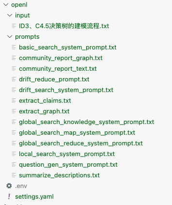

# 1.GraphRAG安装与项目创建
## step1:搭建环境
### conda创建env环境
```bash
conda create -n graphrag python=3.10
```
### 激活环境
```bash
conda activate graphrag
```
### 安装依赖
```bash
pip install graphrag
```

## step2:创建检索项目文件夹
```bash
mkdir -p ./openl/input
```

## Step 3.上传数据集到input文件夹
- ID3、C4.5决策树的建模流程.txt

## Step 4.初始化项目文件
```bash
graphrag init --root ./openl
```
显示
```bash
Initializing project at /Users/ericyoung/ysx/code/github-study/RAG/graphRag/openl
⠋ GraphRAG Indexer %
```


## Step 5.修改项目配置,配置LLM模型信息
- .env中的GRAPHRAG_API_KEY,  填写LLM API-KEY
- settings.yaml中的大模型配置
```yaml
models:
  default_chat_model:
    type: openai_chat # or azure_openai_chat
    api_base: https://api.deepseek.com
    model: deepseek-chat  #修改
    api_key: ${CHAT_API_KEY} # set this in the generated .env file
    encoding_model: cl100k_base # ⚠️automatically set by tiktoken if left undefined
    model_supports_json: false
...
default_embedding_model:
    type: openai_embedding # or azure_openai_embedding
    api_base: https://api.siliconflow.cn/v1  # ⚠️
    model: BAAI/bge-m3
    encoding_model: cl100k_base # ⚠️ automatically set by tiktoken if left undefined
    model_supports_json: false
```

## Step 6.验证LLM模型是否可用

# 2.GraphRAG索引Indexing过程执行
## Step 7.借助GraphRAG脚本自动执行indexing
### 索引阶段
```bash
graphrag index --root ./openl
```
- 运行结束后，各知识图谱相关数据集都保存在output文件夹中：
- GraphRAG在索引阶段构建的知识图谱的确是以 Parquet 格式保存的！
- 索引阶段的输出文件中，Parquet 文件存储了知识图谱的各个核心组成部分，例如实体、关系、社区信息以及文本单元等。这些文件共同组成了一个完整的知识图谱。


- 索引阶段的主要输出内容如下：
1. 实体表（Nodes Table）
  - 文件名：create_final_nodes.parquet
  - 内容：知识图谱中的实体节点（例如：人、地点、组织）。
  - 包含信息：
    - 实体的名称（如 "John Doe"）。
    - 实体的类别（如 "PERSON", "ORGANIZATION", "LOCATION"）。
    - 与社区相关的信息（如实体所属的社区）。
    - 实体的度数（degree），表示该实体在图谱中的连接数。
2. 关系表（Relationships Table）
  - 文件名：create_final_relationships.parquet
  - 内容：知识图谱中实体之间的关系（即图谱的边）。
  - 包含信息：
    - 两个实体之间的关系描述（例如 "works for", "lives in"）。
    - 关系的强度（数值化，用于衡量关系的显著性或重要性）。
3. 嵌入向量表（Entity Embedding Table）
  - 文件名：create_final_entities.parquet
  - 内容：实体的语义嵌入，用于表示实体的语义信息。
  - 用途：支持语义搜索（通过嵌入计算实体之间的相似性）。
4. 社区报告表（Community Reports Table）
  - 文件名：create_final_community_reports.parquet
  - 内容：社区的摘要信息。
  - 用途：支持全局搜索（通过社区信息回答关于数据集整体的问题）。
5. 文本单元表（Text Units Table）
  - 文件名：create_final_text_units.parquet
  - 内容：被切分的原始文本单元（TextUnits）。
  - 用途：将知识图谱和原始文本结合，为 LLM 提供上下文支持。
6. 社区表（Community Table）
  - 文件名：create_final_Communities.parquet
  - 内容：每个社区基本情况。
7. 文件表（Documents Table）
  - 文件名：create_final_documents.parquet
  - 内容：用于记录所有参与知识图谱构建的文件情况。

**为什么用 Parquet 格式保存知识图谱？**
1. 高效存储：
- 知识图谱中的数据通常是结构化的，包含大量的实体、关系、嵌入等。
- Parquet 的列式存储能够显著减少磁盘占用，同时提高读取效率。
2. 快速读取：
- 查询阶段需要快速加载实体、关系、嵌入等数据到内存中。
- Parquet 支持按需加载所需的列，避免了不必要的数据读取。
3. 兼容性好：
- Parquet 是一个开放的标准，广泛支持各种数据处理工具（如 Pandas、Spark、Hadoop）。
- GraphRAG 可以在 Python 中使用 Pandas 或其他工具轻松读取这些文件。

# 3.查看知识图谱相关表格
## 使用pandas读取Parquet文件
```python
import pandas as pd
# 读取 Parquet 文件
nodes_df = pd.read_parquet('./openl/output/create_final_nodes.parquet')
relationships_df = pd.read_parquet('./openl/output/create_final_relationships.parquet')
entities_df = pd.read_parquet('./openl/output/create_final_entities.parquet')
community_reports_df = pd.read_parquet('./openl/output/create_final_community_reports.parquet')
text_units_df = pd.read_parquet('./openl/output/create_final_text_units.parquet')
communities_df = pd.read_parquet('./openl/output/create_final_Communities.parquet')
documents_df = pd.read_parquet('./openl/output/create_final_documents.parquet')
# 显示数据框的前几行
print("Nodes DataFrame:")
print(nodes_df.head())
```

## 生成的知识图谱文件类型
- 文件表（Documents Table）documents_df = pd.read_parquet("./openl/output/create_final_documents.parquet")
- 文本单元表（TEXT UNIT Table） text_unit_df = pd.read_parquet("./openl/output/create_final_text_units.parquet")
- 实体嵌入表（ENTITIES Table） entity_embedding_df = pd.read_parquet("./openl/output/create_final_entities.parquet")
- 实体表（Nodes Table）  entity_df = pd.read_parquet("./openl/output/create_final_nodes.parquet")
- 关系表（Relationships Table） relationships_df = pd.read_parquet("./openl/output/create_final_relationships.parquet")
- 社区表（Community Table） communities_df = pd.read_parquet("./openl/output/create_final_Communities.parquet")
- 社区报告表（Community Reports Table） community_reports_df = pd.read_parquet("./openl/output/create_final_community_reports.parquet")

### 社区报告表
社区报告（Community Reports） 每一行代表一个社区的摘要信息，包含了与该社区相关的标题、摘要、实体、关系等详细内容。这些信息是 GraphRAG 在索引阶段基于知识图谱生成的高层次语义总结，用于帮助回答关于数据集整体的问题（例如全局搜索）。
表格字段的含义
1. id
  - 每个社区的唯一标识符（UUID）。
  - 这是系统内部生成的，通常用于追踪社区记录。
2. human_readable_id
  - 更容易理解的人类可读ID（数字化或短标识符）。
  - 通常用于直观地区分社区。
3. community
  - 社区的编号，代表社区的分类或标识。
4. level
  - 社区层级（COMMUNITY_LEVEL）。
  - 表示社区的聚类粒度。较低的值表示更抽象的层级，较高的值表示更具体的细分社区。
5. title
  - 社区的标题。
  - 对该社区的简要描述，用于表示该社区的主题核心。例如：
    - ID3 Decision Tree Algorithm Community
    - C4.5 and Sklearn Integration
6. summary
  - 社区的摘要。
  - 对该社区内容的进一步扩展描述，解释其主题或涵盖的主要内容。
7. full_content
  - 社区报告的完整内容。
  - 包括更详细的信息，可能包含标题、摘要、重要发现等。
8. rank
  - 社区的排名或评分。
  - 可能用来表示社区的重要性、影响力或相关性。
9. rank_explanation
  - 对排名的解释。
  - 例如，“影响严重性从中等到高”。
10. findings
  - 社区的主要发现（JSON 格式）。
  - 包含详细的解释或分析。例如：
    - ID3 算法是该社区的核心主题。
    - C4.5 是 ID3 的改进版本，结合了 Sklearn 的功能。
11. full_content_json
  - 社区完整内容的 JSON 表示。
  - 如果需要以结构化方式处理社区内容，这个字段是关键。
12. period
  - 报告的时间戳或周期。
  - 在你的示例中，是 2024-11-26，表示报告生成的日期。
13. size
  - 社区的大小。
  - 表示该社区包含的实体或内容的数量。例如：
    - 社区 0 包含 8 个内容。
    - 社区 1 包含 2 个内容。

### 结果解释
从你的结果中可以看出：
1. 社区 0：
  - 标题是“ID3 Decision Tree Algorithm Community”。
  - 主题围绕 ID3 决策树算法。
  - 内容提到了该算法的重要性，以及其对机器学习领域的影响。
  - 社区大小为 8。
2. 社区 1：
  - 标题是“C4.5 and Sklearn Integration”。
  - 主题是 C4.5 算法和 Sklearn 的集成。
  - 该社区比社区 0 更小（仅有 2 个内容）。
  - 排名评分为 4.5，影响程度适中。
### 用途
社区报告在查询阶段可以用于：
1. 全局搜索（Global Search）：
  - 回答关于数据集整体的问题，例如“这些文档的主要主题是什么？”
2. 快速理解社区：
  - 帮助用户快速了解数据集中不同部分的主题和相关信息。
3. 可视化与调试：
  - 将这些社区报告与知识图谱结合起来，可以直观地呈现社区的结构和语义关系。

# 4.查询阶段
## GraphRAG问答流程
```bash
graphrag query --root ./openl --method local --query "请帮我介绍下 ID3 算法，请用中文回答。"
graphrag query --root ./openl --method global --query "请帮我介绍下 ID3 算法，请用中文回答。"